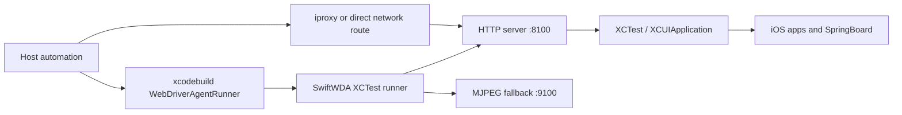

# Architecture

SwiftWDA is a small XCTest runner with a device-local HTTP server. The host launches it with Xcode, reads the startup marker, and then sends WebDriverAgent-style commands over HTTP.

## Runtime Flow

## Main Components

| Component | Responsibility |
| --- | --- |
| `IntegrationApp` | Minimal app target used as the UI test host. |
| `WebDriverAgentRunnerTests.swift` | XCTest entrypoint; starts HTTP and MJPEG servers and prints startup markers. |
| `HTTPServer.swift` | Lightweight Network.framework HTTP and MJPEG server. |
| `WDAAgent.swift` | Route handling, XCTest bridge, sessions, app lifecycle, screenshots, metrics, location simulation. |
| `ElementTree.swift` | Source tree and element lookup support. |
| `WDATypes.swift` | Shared request, response, error, and settings models. |

## Design Constraints

- Keep the `WebDriverAgentRunner` scheme name for host compatibility.
- Preserve `ServerURLHere->` and `MJPEGServerURLHere->` startup markers.
- Avoid a large vendored dependency tree.
- Keep signing external and generic.
- Use public XCTest APIs for the normal control path.
- Isolate platform-specific or private-selector behavior behind explicit fallback paths.

## Session Model

SwiftWDA keeps one active session at a time. The session records the requested app bundle id, known bundle ids observed during the run, alert handling preferences, and the last known foreground app. This makes source, screenshot, active app info, and lifecycle commands stable across repeated requests.

## Observability

`/wda/healthcheck` reports service readiness and XCTest responsiveness. `/metrics` exposes Prometheus-style counters for request count, error count, average latency, uptime, active session state, lock capability, MJPEG port, and native location support.
